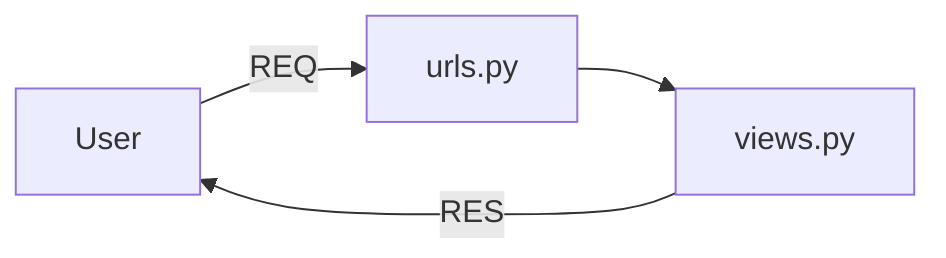

# Django_Guide
## Requirement
1. install python
2. install uv
## Make a virtual environment
method 1 :- 
```python
$ python -m venv .venv
```
method 2 :- 
```python
$ uv venv
```
## To activate virtual environment
```python
.venv\scripts\activate
```
## Install Django
```python
(.venv) $uv pip install Django
```
## Make a Django project
```python
(.venv) $django-admin startproject basicProject01
```
## Run a Django project
```python
$ python manage.py runserver
```
- ERROR if port is already in use Error
```python
$ python manage.py runserver 8001
```
## Django server architecture

### Django Request-Response Flow

```mermaid
flowchart LR
    User -->|req| Browser
    Browser -->|req| Django
    Django --> urlResolver[URL Resolver]
    urlResolver --> urls1[urls.py]
    urls1 --> urls2[urls.py]
    urls2 --> views[views.py (controller)]
    views --> model[model.py]
    model --> DB[DB]
    views --> Templates[Templates]
    views -->|Response| Django
    Django -->|res| Browser
    Browser -->|res| User
```

> basicProject01/basicProject01/views.py
```python
from django.http import HttpResponse

def home(request):
  return HttpResponse("home route")

def sidd(request):
  return HttpResponse("hello i am sidd")
```
>  basicProject01/basicProject01/urls.py
```python
from django.contrib import admin
from django.urls import path
from . import views

urlpatterns = [
    path('admin/',admin.site.urls)
    path('',views.home, name='home')
    path('sidd',views.sidd, name='sidd')
]
```
