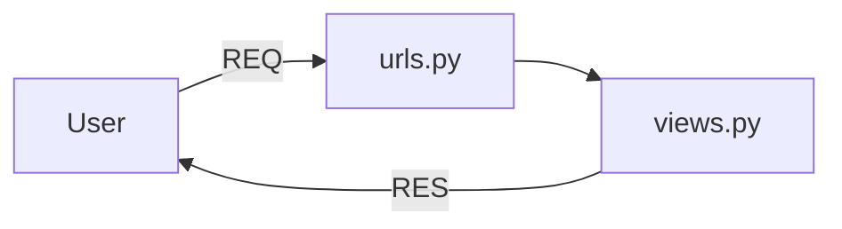

# Django_Guide
## Requirement
1. install python
2. install uv
## Make a virtual environment
method 1 :- 
```python
$ python -m venv .venv
```
method 2 :- 
```python
$ uv venv
```
## To activate virtual environment
```python
.venv\scripts\activate
```
## Install Django
```python
(.venv) $uv pip install Django
```
## Make a Django project
```python
(.venv) $django-admin startproject basicProject01
```
## Run a Django project
```python
$ python manage.py runserver
```
- ERROR if port is already in use Error
```python
$ python manage.py runserver 8001
```
## Django server architecture
#### Django Request-Response Flow


> basicProject01/basicProject01/views.py
```python
from django.http import HttpResponse

def home(request):
  return HttpResponse("home route")

def sidd(request):
  return HttpResponse("hello i am sidd")
```
>  basicProject01/basicProject01/urls.py
```python
from django.contrib import admin
from django.urls import path
from . import views

urlpatterns = [
    path('admin/',admin.site.urls)
    path('',views.home, name='home')
    path('sidd',views.sidd, name='sidd')
]
```
## Django Folder Structure
- .venv
- basicProject01
    - basicProject01
- static
- - style.css
- templates
    - index.html
- db.sqlite3
- manage.py
## Render html page
> views.py
```python
from django.shortcuts import render

def home(request):
    return render(request, 'website/index.html')
```
```diff 
- Error :- TemplateDoesNotExist at /
```
### Resolve Error
> basicProject01/basicProject01/settings.py
```diff
TEMPLATES = [
    {
        'BACKEND': 'django.template.backenss.django.DjangoTemplates',
        'DIRS': ['templates'], ✅ 
        'APP_DIRS': True,
    }
]
```
## Link style.css
```diff
+ 
<!DOCTYPE>
+ <link rel="stylesheet" href="">
```
> basicProject01/basicProject01/settings.py
```diff
import os

STATIC_URL = 'static/'
+ STATICFILES_DIRS = [os.path.join(BASE_DIR, 'static')]
```
## How to make Django app
```python
$python manage.py startapp sidd
```
step 1:- To aware main project in our new app
> basicProject01/basicProject01/settings.py
```python
INSTALLED_APPS = [
    'django.contrib.staticfiles',
    'sidd',                                ⚠️
]
```
## to configure emmit abbreviations in vsCode
- press CTRL + , and search emmit
    - Emmet: Include Languages -> click on Add Item
    - Item = django-html, Value = html
  
> sidd/templates/sidd/all_sidd.html
> sidd/views.py
```python
from django.shortcuts import render

def all_sidd(request):
    return render(request,'sidd/all_sidd.html
```
## url transfer in a app
> basicProject01/basicProject01/urls.py
```python
from django.contrib import admin
from django.urls import path, include
from . import views
urlpatterns = [
    path('admin/',admin.site.urls)
    path('',views.home, name='home')
    path('sidd',views.sidd, name='sidd')
    path('sidd/', include('sidd.urls))

```
> sidd/urls.py
```python
from django.urls import path
from . import views
urlpatterns = [
    path('', views.all_sidd, name="all_home),
    path('order/', viewa.order, name='all_sidd'),
]
```
## > basicProject01/templates/layout.html
```html

<!doctype html>
<html>
  <head>
    <meta http-equiv="X-UA-Compatible" content="IE=edge,chrome=1">
    <meta name="description" content="{{ page_description | escape }}">
    <title>
        
            Default value
        
    </title>
    <link rel="stylesheet" href="">
  </head>
  <body>
    <nav>this is navbar </nav>

  </body>
</html>
```
