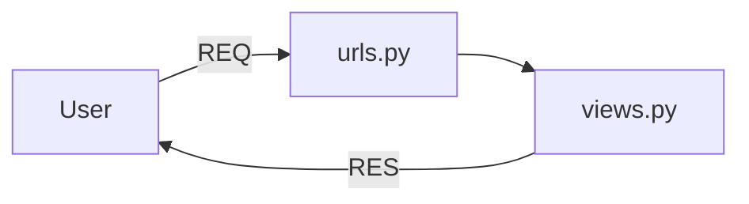

# Django_Guide
## Requirement
1. install python
2. install uv
## Make a virtual environment
method 1 :- 
```python
$ python -m venv .venv
```
method 2 :- 
```python
$ uv venv
```
## To activate virtual environment
```python
.venv\scripts\activate
```
## Install Django
```python
(.venv) $uv pip install Django
```
## Make a Django project
```python
(.venv) $django-admin startproject basicProject01
```
## Run a Django project
```python
$ python manage.py runserver
```
- ERROR if port is already in use Error
```python
$ python manage.py runserver 8001
```
## Django server architecture
#### Django Request-Response Flow


> basicProject01/basicProject01/views.py
```python
from django.http import HttpResponse

def home(request):
  return HttpResponse("home route")

def sidd(request):
  return HttpResponse("hello i am sidd")
```
>  basicProject01/basicProject01/urls.py
```python
from django.contrib import admin
from django.urls import path
from . import views

urlpatterns = [
    path('admin/',admin.site.urls)
    path('',views.home, name='home')
    path('sidd',views.sidd, name='sidd')
]
```
## Django Folder Structure
- .venv
- basicProject01
    - basicProject01
- static
- - style.css
- templates
    - index.html
- db.sqlite3
- manage.py
## Render html page
> views.py
```python
from django.shortcuts import render

def home(request):
    return render(request, 'website/index.html')
```
```diff 
- Error :- TemplateDoesNotExist at /
```
### Resolve Error
> basicProject01/basicProject01/settings.py
```diff
TEMPLATES = [
    {
        'BACKEND': 'django.template.backenss.django.DjangoTemplates',
      + 'DIRS': ['templates'],
        'APP_DIRS': True,
    }
]
```
<pre>
TEMPLATES = [
    {
        'BACKEND': 'django.template.backenss.django.DjangoTemplates',
      <strong style="color:red;">+ 'DIRS': ['templates'],</strong>
        'APP_DIRS': True,
    }
]
</pre>
## Link style.css
```diff
+ 
<!DOCTYPE>
+ <link rel="stylesheet" href="">
```
> basicProject01/basicProject01/settings.py
```diff
import os

STATIC_URL = 'static/'
+ STATICFILES_DIRS = [os.path.join(BASE_DIR, 'static')]
```
## How to make Django app
```python
$python manage.py startapp sidd
```
step 1:- To aware main project in our new app
> basicProject01/basicProject01/settings.py
```python
INSTALLED_APPS = [
    'django.contrib.staticfiles',
    'sidd',
]
```
